# System Alert

[English README](README.md)

AIMON 是一个用 Rust 编写的 macOS 终端系统监控工具。它偏向 Apple Silicon 机器，主要在 TUI 中展示实时 CPU、内存、电池、温度、进程、网络、磁盘、功耗、能耗和碳排估算信息。

程序可以不使用 root 权限运行，但 Apple `powermetrics` 相关数据在没有 `sudo` 时会受限。

## 当前状态

这是一个仍在活跃开发中的本地/系统监控工具，不是已经完整打包的桌面应用。目前仓库支持：

- 多布局交互式终端 UI。
- 面向 macOS 和 Apple Silicon 的功耗/温度采集。
- 基于 package power 采样的本次运行能耗和 CO₂ 估算。
- JSON、CSV 和流式输出模式。
- 主题切换和 TOML 配置。

部分数值是估算值。进程级能耗是根据进程 CPU 占比和 package power 估算出来的，适合在本次运行中做相对比较，但不是硬件直接提供的单进程电表读数。

## 截图

| 布局 | 预览 |
| --- | --- |
| 启动页 (`0`) | 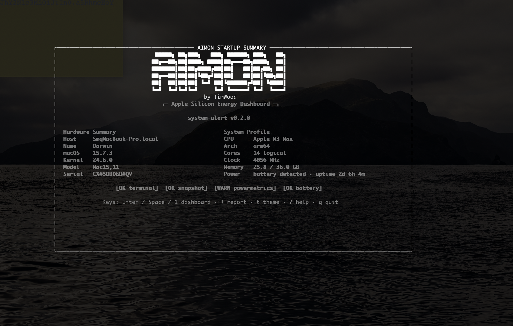 |
| Full 布局 (`1`) | 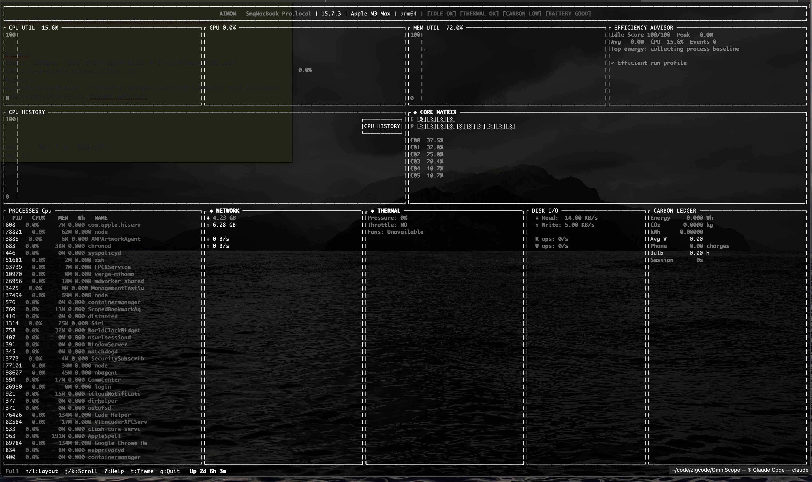 |
| Advanced 布局 (`2`) | 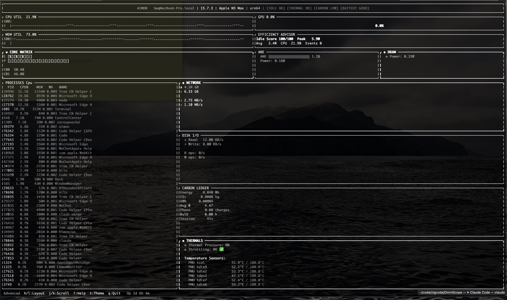 |
| Minimal 布局 (`3`) | 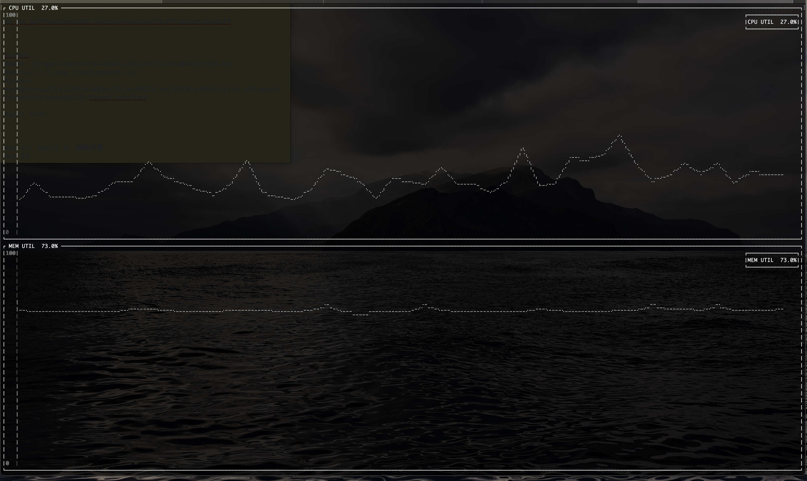 |
| Compact 布局 (`4`) | 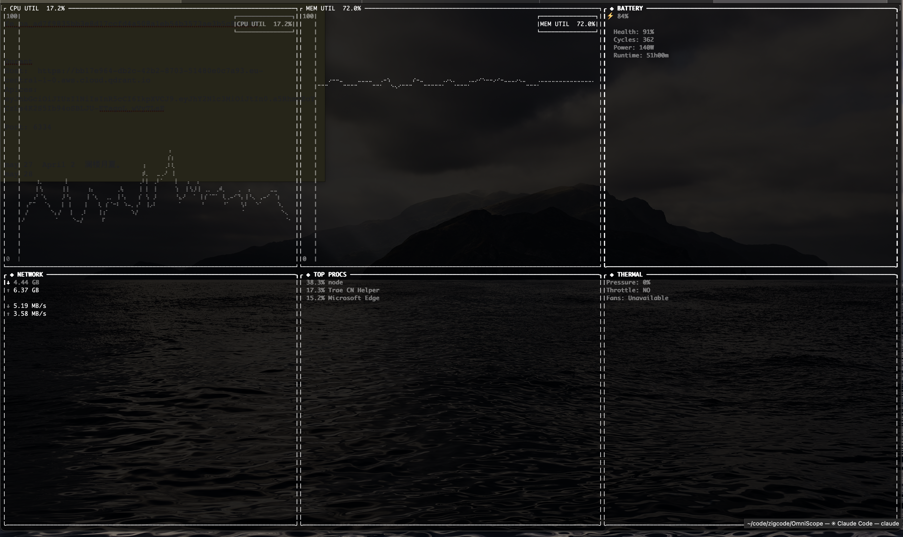 |
| Battery 布局 (`5`) | 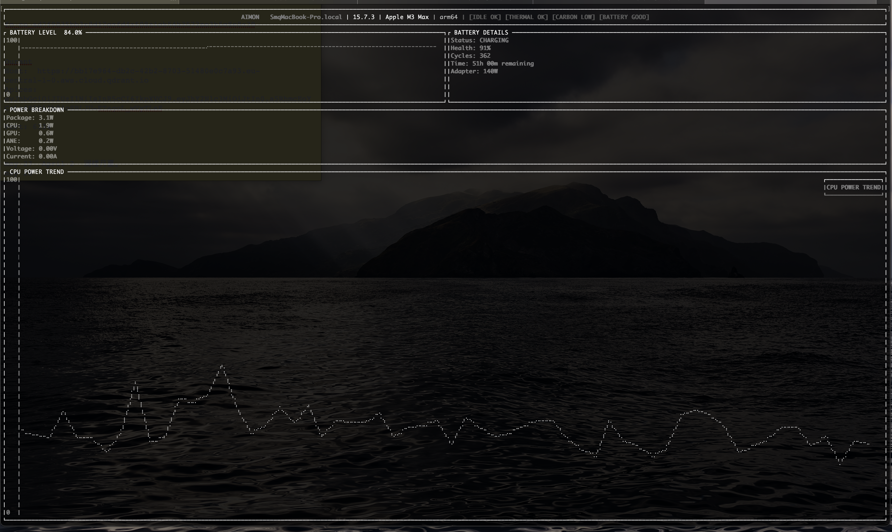 |
| GPU 布局 (`6`) | 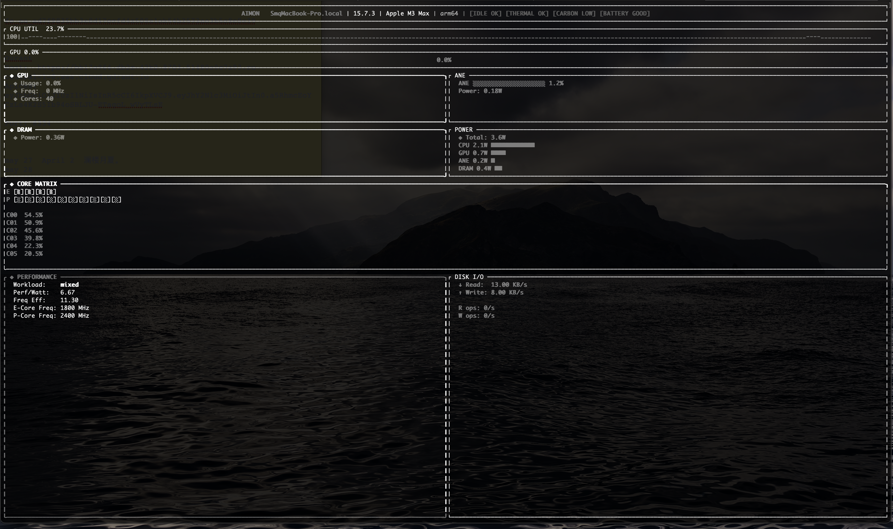 |
| Network 布局 (`7`) | 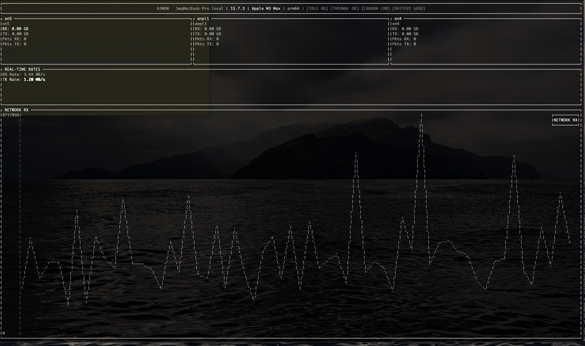 |
| System Health 布局 (`8`) | 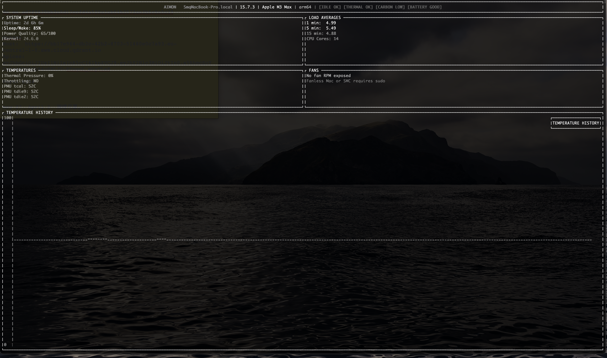 |
| Thermal 布局 (`9`) | 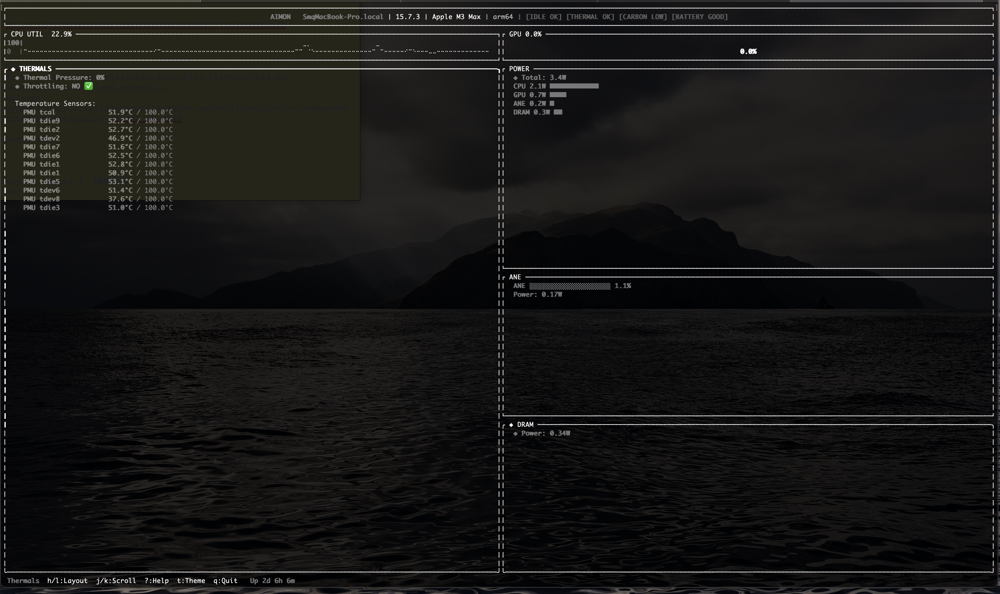 |
| 本次运行报告 / 退出页 | 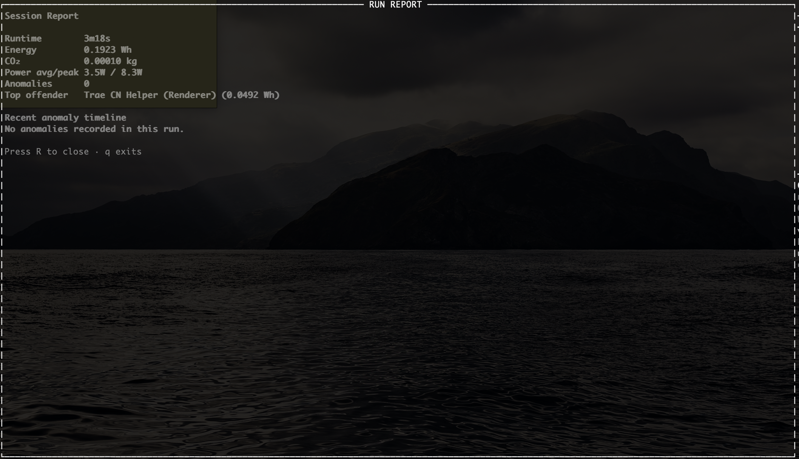 |

## 环境要求

- macOS。本项目依赖 macOS 系统命令，并围绕 Apple Silicon 指标设计。
- Rust 工具链，用于从源码构建。
- 建议使用 `sudo` 启动，以获得完整 `powermetrics` 数据。

## 构建与运行

```bash
cargo build --release
sudo ./target/release/system-alert
```

开发运行：

```bash
sudo cargo run
```

如果只需要普通用户权限可采集到的指标，也可以不加 `sudo`：

```bash
cargo run
```

## CLI 参数

```bash
system-alert [options]

Options:
  -r, --refresh <SECONDS>     刷新间隔，单位秒
      --refresh-ms <MILLIS>   刷新间隔，单位毫秒；会覆盖 --refresh
  -m, --minimal               以 minimal 显示模式启动
  -c, --config <FILE>         加载自定义 TOML 配置文件
  -t, --theme <THEME>         设置初始主题
      --lang <LANG>           设置支持路径中的语言值：en、zh
      --json                  输出一次 JSON 快照后退出
      --csv                   输出一次 CSV 快照后退出
      --stream <FORMAT>       流式输出：json、csv、prometheus
  -h, --help                  显示帮助
  -V, --version               显示版本
```

示例：

```bash
sudo cargo run -- --refresh 2
sudo cargo run -- --refresh-ms 500
sudo cargo run -- --theme mactop_green
cargo run -- --json
cargo run -- --stream prometheus
```

## 键盘操作

| 按键 | 动作 |
| --- | --- |
| `0` | 启动页 |
| `1` | Full 布局 |
| `2` | Advanced 布局 |
| `3` | Minimal 布局 |
| `4` | Compact 布局 |
| `5` | Battery 布局 |
| `6` | GPU 布局 |
| `7` | Network 布局 |
| `8` | System Health 布局 |
| `9` | Thermal 布局 |
| `h` / `←` | 上一个布局 |
| `l` / `→` / `Tab` | 下一个布局 |
| `j` / `↓` | 向下滚动 |
| `k` / `↑` | 向上滚动 |
| `g` | 跳到顶部 |
| `G` | 跳到底部 |
| `s` | 正向切换进程排序 |
| `S` | 反向切换进程排序 |
| `r` | 强制刷新/重绘 |
| `R` | 打开/关闭本次运行报告 |
| `t` | 切换主题 |
| `n` | 开关通知 |
| `?` | 打开/关闭帮助层 |
| `q` | 先展示本次运行报告；在报告页再按一次退出 |
| `Ctrl+C` | 与 `q` 使用同一退出事件路径 |

## UI 功能

- **启动页**：居中的 dashboard 入口页，展示硬件摘要、自检结果和脱敏后的序列号。
- **状态 Badge**：顶部显示 idle power、thermal、carbon、battery 等状态。
- **Core Matrix**：Full 布局中以紧凑 cell 展示 E-core/P-core 活动。
- **Power Stack**：在可用时展示 CPU/GPU/ANE/DRAM 对 package power 的组成。
- **进程表**：展示进程 CPU、内存，以及本次运行累计估算 Wh。
- **Efficiency Advisor**：提示高 idle power，并展示最近异常采样。
- **Session Report**：展示运行时长、总 Wh、CO₂ 估算、平均/峰值功耗、异常次数和估算能耗最高进程。
- **电池续航估算**：放电状态下，根据最近功耗和电量估算剩余时间。

## 无界面输出

一次性 JSON：

```bash
cargo run -- --json
```

一次性 CSV：

```bash
cargo run -- --csv
```

流式输出：

```bash
cargo run -- --stream json
cargo run -- --stream csv
cargo run -- --stream prometheus
```

## 配置

默认配置文件是 `config.toml`。可以用 `--config` 指定其他文件。

重要配置段：

- `refresh_rate` 和 `minimal_mode`：基础运行行为。
- `[thresholds]`：CPU、内存和温度告警阈值。
- `[display]`：可选面板、历史长度和主题。
- `[notifications]`：通知开关和冷却时间。

示例：

```toml
refresh_rate = 1
minimal_mode = false

[display]
history_size = 60
theme = "mactop_green"

[notifications]
enabled = true
cooldown_seconds = 30
```

## 主题

运行时按 `t` 会在当前应用返回的 mactop 风格前景色主题中切换：

- `mactop_green`
- `mactop_red`
- `mactop_blue`
- `mactop_yellow`
- `mactop_magenta`
- `mactop_cyan`
- `mactop_white`

主题模块中还存在其他命名主题构造函数，但并不是每一个都会进入当前运行时循环列表。

## 隐私说明

- 启动页会对硬件序列号做脱敏，只保留首尾各两个字符，中间用短哈希替代。
- 无界面 JSON/API 输出可能仍包含 `SystemData` 暴露的字段；公开日志前请先检查输出。
- 正常监控不需要网络访问，工具读取的是本机系统指标。

## 限制

- 完整功耗数据依赖 macOS `powermetrics` 的权限和可用性。
- 某些传感器在不同 Mac 或 macOS 版本上可能不可用。
- 进程 Wh 是当前会话估算值，不是硬件直接计数器。
- 电池续航预测基于最近功耗和电量百分比，应视作估算。
- UI 依赖终端尺寸，终端过小时部分面板可能被截断。

## 常见问题

如果功耗值缺失或为 0，优先尝试使用 `sudo`：

```bash
sudo cargo run
```

检查 `powermetrics` 是否可用：

```bash
which powermetrics
sudo powermetrics --samplers cpu_power,gpu_power -n 1
```

如果 UI 太挤，请放大终端，或切换到 battery、GPU、network、health、thermals 等聚焦布局。

如果构建检查因为 `sccache` 等 wrapper 受限失败，可以运行：

```bash
RUSTC_WRAPPER= cargo check
```

## 项目结构

```text
src/
├── main.rs              # TUI 运行时和主事件循环
├── cli.rs               # CLI 解析和键盘输入
├── config.rs            # TOML 配置
├── collectors/          # CPU、GPU、内存、进程、电池、网络、温度等采集器
├── carbon/              # 能耗/碳排追踪和 advisor 渲染
├── api/                 # JSON、CSV 和 Prometheus 无界面输出
├── ui/                  # Ratatui 布局和组件
├── history.rs           # 时间序列历史缓冲
└── types.rs             # 共享数据结构
```

## 许可证

见 `LICENSE`。
